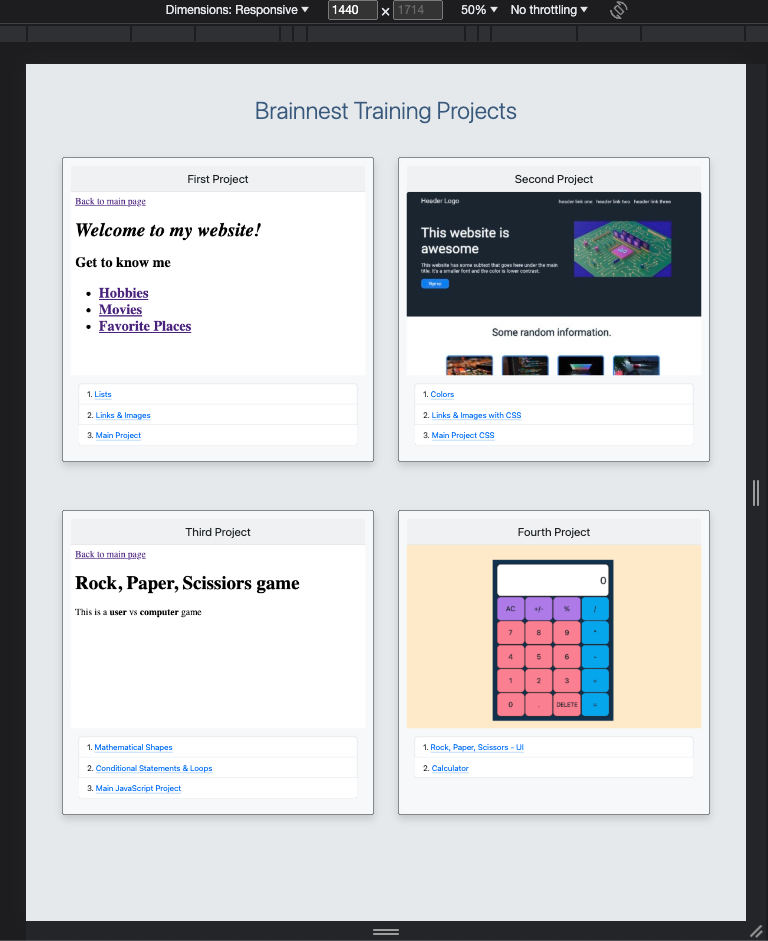

# Brainnest-Projects

## Table of contents

- [Overview](#overview)
  - [Screenshot](#screenshot)
  - [Links](#links)
- [My process](#my-process)
  - [Project 1](#project-1)
  - [Project 1](#project-2)
  - [Project 1](#project-3)
  - [Project 1](#project-4)
  - [Built with](#built-with)
  - [What I learned](#what-i-learned)
- [Author](#author)

## Overview
  Brainnest Frontend Development Industry Training was a program offered by the Brainnest company.
  In this program I've built four projects with HTML, CSS and JavaScript.

### Screenshot

### Links

- Solution URL: [Solution URL here](https://github.com/AlinaAlexandraVizireanu/Brainnest-Projects)
- Live Site URL: [Live site URL here](https://alinaalexandravizireanu.github.io/Brainnest-Projects/)

## My process
  During this training I've built four projects using HTML, CSS, JavaScript and Bootstrap.
  
  ### Project 1
  In project one I've used only HTML and in this part I've learned the structure of a webpages and how to navigate through different webpages from the same website.
  This project consists in three parts:
    1. Working with lists
    2. Working with links and images
    3. Building an "About me" page

  ### Project 2
  In project two I've startes to use CSS and I've built a landing page.
  This project consists in three parts:
    1. Working with colors
    2. Working with links and images designed with CSS
    3. Building a landing page

  ### Project 3
  In project three I've started to use JavaScript and I've implemented the logic for Rock, Paper, Scissors game.
  This project consists in three parts:
    1. Solving different math problems using JavaScript
    2. Working with conditional statements and loops
    3. Implementing the logic for Rock, Paper, Scissors game.

 ### Project 4
  In project four I've started to use DOM and I've built the user interface for Rock, Paper, Scissors game and I've also developed a Calculator.
  This project consists in two parts:
    1. Working with DOM for implementing the user interface for Rock, Paper, Scissors game
    2. Developing the a Calculator.

### Built with

- Semantic HTML5 markup
- CSS custom properties
- Flexbox
- [Bootstrap](https://getbootstrap.com/)

### What I learned

This training helped me to improve my skills regarding HTML, CSS and JavaScript.

## Author

- Website - [Vizireanu Alina Alexandra](https://alinaalexandravizireanu.github.io/Brainnest-Projects/)
